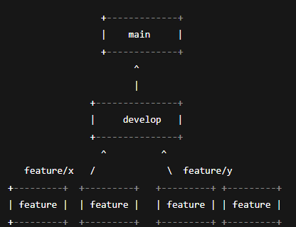

Projeto PixelTrack
Visão Geral
Este projeto é parte da Atividade Prática de Revisão do curso Integração e Entrega Contínua (IEC). A startup PixelTrack desenvolve um painel para estatísticas em tempo real de eSports, e o foco da atividade é aplicar práticas de DevOps entre as Aulas 04 e 09.

1. Organização e Fluxo com Git e GitHub
Descrição
Utilizamos o modelo Git Flow para organizar o desenvolvimento:

Branch principal main para código estável em produção.

Branch develop para integração das funcionalidades em desenvolvimento.

Branches feature/* para desenvolvimento isolado de funcionalidades.

Boas práticas adotadas
Mensagens claras e padronizadas em commits:

Ex: feat: adicionar ranking de jogadores

Ex: fix: corrigir bug no cálculo de pontos

Uso do git pull --rebase para manter histórico linear e evitar merges desnecessários.

Fluxograma

(Inserir aqui a imagem digitalizada do fluxograma que você desenhou)

2. Configuração de CI com GitHub Actions
Arquivo .github/workflows/ci.yml
Workflow configurado para rodar testes automaticamente a cada push e pull request nas branches main e develop. Executa:

Checkout do código.

Setup do Node.js versão 18.

Instalação de dependências com npm ci.

Execução dos testes com npm test.

Print da execução
(Inserir print do GitHub Actions mostrando execução bem-sucedida dos testes)

3. Testes Automatizados e Cobertura
Função converterPontos
js
Copiar
Editar
function converterPontos(score) {
  if (score < 0) return 0;
  return score * 10;
}
Testes com Jest
Valida comportamento com pontos positivos, zero e negativos.

Usa expect().toBe() para comparação exata.

Cobertura
Testes cobrem todos os cenários esperados, garantindo que não haja regressões.

Print do relatório de cobertura
(Inserir print do terminal ou ferramenta mostrando a cobertura do Jest)

4. Monitoramento e Logging com Docker
Arquivo docker-compose.yml
Contém os serviços:

app: aplicação Node.js.

prometheus: coleta métricas da aplicação.

grafana: dashboard para visualização.

loki + promtail: coleta e armazenamento de logs.

Configurações adicionais
Arquivos prometheus.yml, loki-config.yaml e promtail-config.yaml configuram como os dados são coletados.

Visualização
Grafana acessível via localhost:3001.

Dashboards configurados para exibir métricas e logs.

Alertas podem ser configurados via Grafana.

Prints
(Inserir prints da tela do Grafana mostrando dashboards e logs)

5. Deploy Automatizado com Firebase Hosting
Passos realizados
Inicialização do Firebase Hosting (firebase init hosting).

Configuração no firebase.json para servir a aplicação estática.

Workflow GitHub Actions para build e deploy automático após push na branch main.

Autenticação configurada via chave de serviço Firebase no GitHub Secrets.

Comando para rollback
bash
Copiar
Editar
firebase hosting:rollback

## 📸 Prints de Execuções

## 🗺️ Diagrama de Fluxo Git

